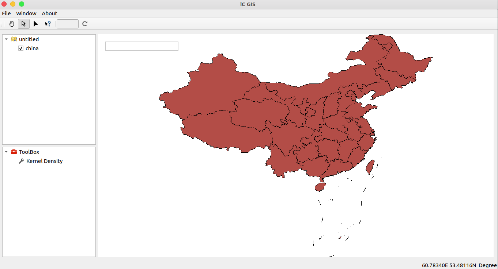
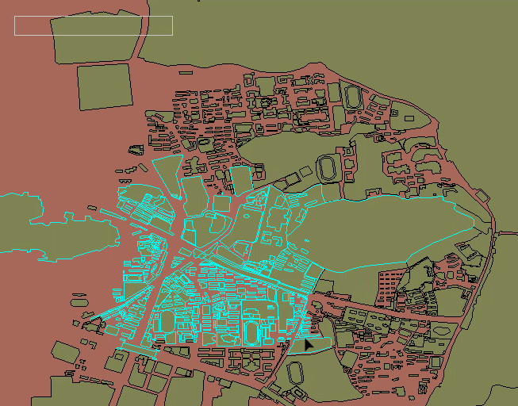
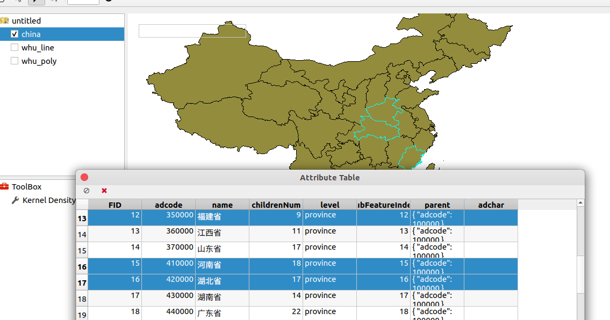
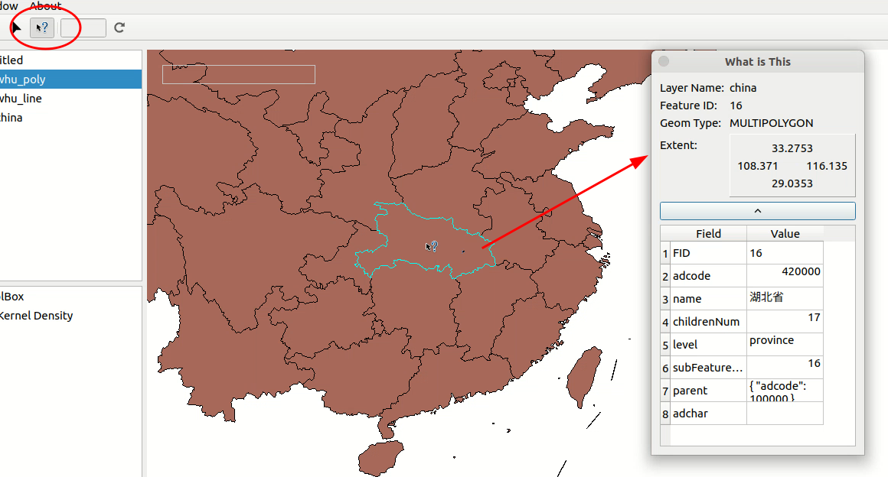
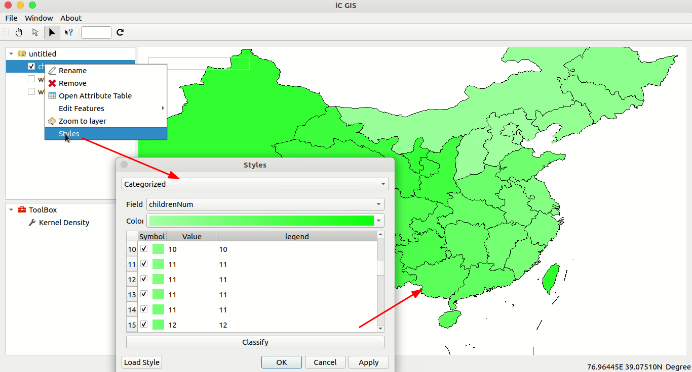

## A simple gis program built in Qt-Creator.

Linux and windows are both supported!

README: [Leopard-C/iCGIS](https://github.com/Leopard-C/iCGIS)

[Prompt]

`lib/unix/libgdal.a` is too lagre to upload to GitHub directly.

It is compressed to `lib/unix/libs&dlls/libs.7z`

And some dll files needed are compressed to `lib/${OS}/libs&dlls/dlls.7z`

## Screenshots

 

## END

<leopard.c@outlook.com>

